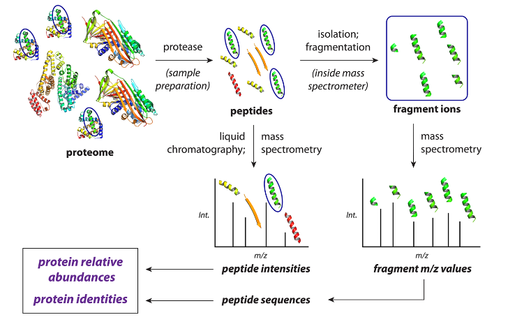

## An Introduction to Mass Spectrometry-Based Proteomics

### Abstract

​		质谱分析 $\text{(Mass Spectrometry)}$ 在研究蛋白质组的几乎任何方面的多功能性 $\text{(versatility)}$ 是无与伦比 $\text{(unmatched)}$ 的。因为以质谱为基础的蛋白质组研究基础复杂并且跨越 $\text{(span)}$ 了多个科学领域，蛋白质组学被认为 $\text{(be perceived as)}$ 门槛很高。这篇教程 $\text{(tutorial)}$ 目的是为了成为一个较为清楚的图解指南 $\text{(accessible illustrated guide)}$，展现较为简单的定量蛋白质组 $\text{(quantitative proteomic)}$ 的实验技术细节。目的是为了解释相关的概念，让对质谱不了解的人能够对蛋蛋白质组学研究有一个基本的认识。本文提供了对实验的概述 $\text{(overview)}$，对实验样品的制备，处理和分析做了清晰的解释。对前沿的课题做了简短的调查，对未来的扩展阅读做了引用。最后，对未来蛋白质组学进行了讨论，考虑了可以补充 $\text{(complement)}$ 质谱分析的下一代蛋白质测序技术，为蛋白质组学创造一个富有成效 $\text{(fruitful)}$ 的未来。

### 1. Introduction

​		基于质谱的蛋白质组学领域由大量实验组成，这些实验提出了有关蛋白质的各种问题，包括有关蛋白质组序列，丰度水平 $\text{(protein sequences and abundance levels)}$，亚细胞区室的内容、蛋白质功能模块 $\text{(protein functions)}$、三维结构 $\text{(three-dimensional structures)}$、化学反应性、蛋白质-蛋白质相互作用 $\text{(protein-protein interactions)}$ 等。在基于质谱的蛋白质组学中，最初的被用于解答这些问题的是质谱仪，用于测量离子质荷比和峰强度 $\text{(mass-to-charge values and signal intensities)}$。质谱能够在多个规模 $\text{(a range of scales)}$ 上进行，从单一蛋白质到数以千计的蛋白质定性以及不同不同复杂程度的样品。

​		作为以质谱为基础的蛋白质组学研究介绍，这篇指南关注在一个最常见且技术简单的基于质谱的蛋白质组学实验：非靶向的自底向上的定量蛋白质实验，使用 $\text{DDA (data-dependent acquisition)}$ 技术在一个复杂的样品例如细胞培养物、生物组织或液体、植物或真菌材料。在这个类型下的研究，使用一种或多种酶将蛋白质从样品被消化 $($水解$)$ 为蛋白质片段，被称为肽段 $\text{(peptides)}$。随后，对肽段进行质谱分析，含有 $7 - 30$ 个氨基酸 $\text{(amino acids)}$ 的肽段最适合作为研究分析对象。当质谱数据使用 $\text{DDA}$ 方式采集，肽段被检测 $\text{(detected)}$ 然后迅速被逐个选择并碎裂 $\text{(fragmentation)}$，从而使得他们序列能够被下游数据分析中被确定 $\text{(be assigned in downstream data analysis)}$。自下而上 $\text{(bottom-up)}$ 这个短语指的是 $\text{(refer to)}$ 从肽段分析中推断 $\text{(subsequent inference)}$ 出蛋白质的信息 $\text{Figure 1}$。

<b>
    Figure 1:
</b> 一个典型的非靶向 $\text{(untargeted)}$ 的自下而上的基于质谱的蛋白质组学实验简化概念概述 $\text{(simplified conceptual overview)}$。使用蛋白酶，蛋白质被酶解为肽段，随之被液相色谱仪器 $\text{(liquid chromatography)}$ 分开 $\text{(be separated by)}$，被喷进 $\text{(sprayed into)}$ 质谱仪中，作为离子进入气相仪 $\text{(gas phase)}$ 中。质谱仪测量被电离化 $\text{(ionized)}$ 的肽段质荷比和由肽段和探测器交互产生的电信号。每张质谱图的电信号强度值 $\text{(Int.)}$ 被画沿 $\text{y}$ 轴上，每一个被选择的肽段集合随之被分开和碎裂，在质谱仪内碎片离子 $\text{(fragmented ions)}$ 被采集。产生的数据被分析，对含氨基酸序列的肽段进行定性分析并测量他们的相对丰度，它们下一步被用于定性和定量蛋白质。一个绿色的肽段被椭圆形蓝色高亮作为例子。

​		在非靶向的蛋白质组研究中，以下是备受关注的，数据被一视同仁地 $\text{(indiscriminately)}$ 分析用来对蛋白质进行定性和估计 $\text{(estimate)}$ 它们的相对丰度。肽段相较于完整的 $\text{(intact)}$ 蛋白质有几个优点，包括尺寸干扰分布 $\text{(distribution)}$ 较为离散 $\text{(disperse)}$，更容易被反相高效液相色谱 $\text{(HPLC)}$ 分离，并且通常产生 $\text{(yield)}$ 更多易被解释的碎片离子光谱（完整的蛋白质分析的优势在 $\text{Advanced Topics and Further Reading}$ 章节中进行讨论，然而非靶向的蛋白质组经常在肽段层面上进行）。实验的每一步，从样品的制备 $\text{(Preparation)}$ 和蛋白质组 $\text{(Protein group)}$ 定量，在下文被详细描述。本文所讨论的技术构成了大多数基于质谱的蛋白质组研究的各个子领域的基础，一部分内容被挑选 $\text{(包含非靶向蛋白质研究，自底向上的质谱技术，DDA)}$ 在 $\text{Advanced Topics and Further Reading}$ 章节中。关于质谱和它们在蛋白质组的应用综述可以在其他地方找到。

### 2. Experimental workflow

​		中间略去一系列样品制备和对质谱仪器的介绍内容

