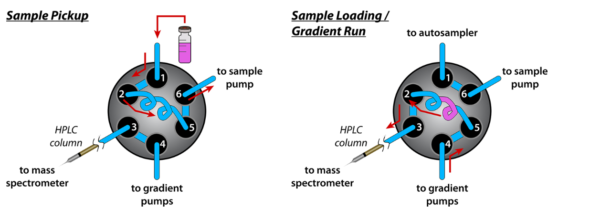
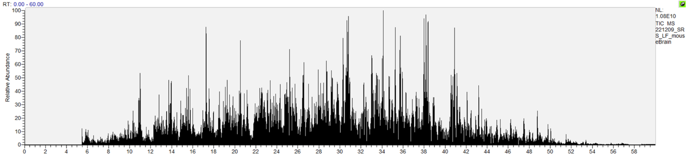
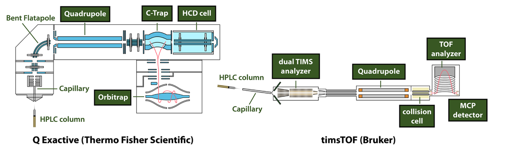
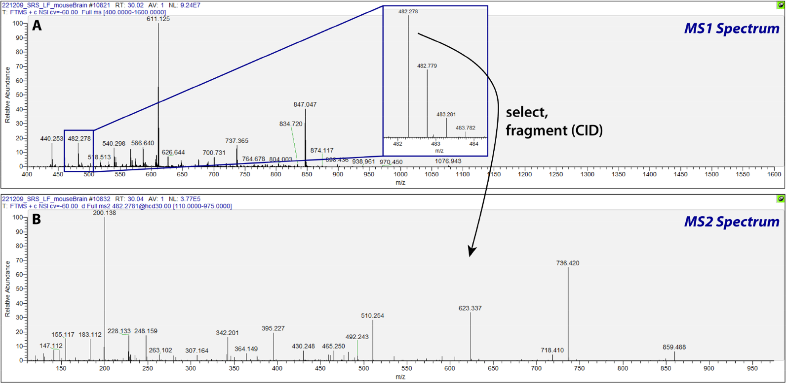
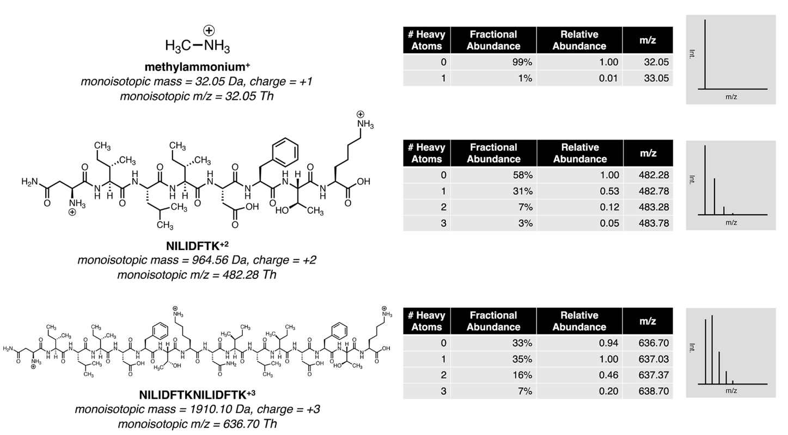
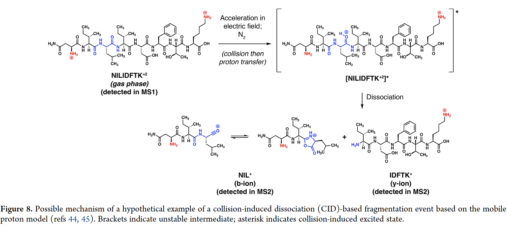

## An Introduction to Mass Spectrometry-Based Proteomics

### Abstract

​		质谱分析 $\text{(Mass Spectrometry)}$ 在研究蛋白质组的几乎任何方面的多功能性 $\text{(versatility)}$ 是无与伦比 $\text{(unmatched)}$ 的。因为以质谱为基础的蛋白质组研究基础复杂并且跨越 $\text{(span)}$ 了多个科学领域，蛋白质组学被认为 $\text{(be perceived as)}$ 门槛很高。这篇教程 $\text{(tutorial)}$ 目的是为了成为一个较为清楚的图解指南 $\text{(accessible illustrated guide)}$，展现较为简单的定量蛋白质组 $\text{(quantitative proteomic)}$ 的实验技术细节。目的是为了解释相关的概念，让对质谱不了解的人能够对蛋蛋白质组学研究有一个基本的认识。本文提供了对实验的概述 $\text{(overview)}$，对实验样品的制备，处理和分析做了清晰的解释。对前沿的课题做了简短的调查，对未来的扩展阅读做了引用。最后，对未来蛋白质组学进行了讨论，考虑了可以补充 $\text{(complement)}$ 质谱分析的下一代蛋白质测序技术，为蛋白质组学创造一个富有成效 $\text{(fruitful)}$ 的未来。

### 1. Introduction

​		基于质谱的蛋白质组学领域由大量实验组成，这些实验提出了有关蛋白质的各种问题，包括有关蛋白质组序列，丰度水平 $\text{(protein sequences and abundance levels)}$，亚细胞区室的内容、蛋白质功能模块 $\text{(protein functions)}$、三维结构 $\text{(three-dimensional structures)}$、化学反应性、蛋白质-蛋白质相互作用 $\text{(protein-protein interactions)}$ 等。在基于质谱的蛋白质组学中，最初的被用于解答这些问题的是质谱仪，用于测量离子质荷比和峰强度 $\text{(mass-to-charge values and signal intensities)}$。质谱能够在多个规模 $\text{(a range of scales)}$ 上进行，从单一蛋白质到数以千计的蛋白质定性以及不同不同复杂程度的样品。

​		作为以质谱为基础的蛋白质组学研究介绍，这篇指南关注在一个最常见且技术简单的基于质谱的蛋白质组学实验：非靶向的自底向上的定量蛋白质实验，使用 $\text{DDA (data-dependent acquisition)}$ 技术在一个复杂的样品例如细胞培养物、生物组织或液体、植物或真菌材料。在这个类型下的研究，使用一种或多种酶将蛋白质从样品被消化 $($水解$)$ 为蛋白质片段，被称为肽段 $\text{(peptides)}$。随后，对肽段进行质谱分析，含有 $7 - 30$ 个氨基酸 $\text{(amino acids)}$ 的肽段最适合作为研究分析对象。当质谱数据使用 $\text{DDA}$ 方式采集，肽段被检测 $\text{(detected)}$ 然后迅速被逐个选择并碎裂 $\text{(fragmentation)}$，从而使得他们序列能够被下游数据分析中被确定 $\text{(be assigned in downstream data analysis)}$。自下而上 $\text{(bottom-up)}$ 这个短语指的是 $\text{(refer to)}$ 从肽段分析中推断 $\text{(subsequent inference)}$ 出蛋白质的信息 $\text{Figure 1}$。

<b>
    Figure 1:
</b> 一个典型的非靶向 $\text{(untargeted)}$ 的自下而上的基于质谱的蛋白质组学实验简化概念概述 $\text{(simplified conceptual overview)}$。使用蛋白酶，蛋白质被酶解为肽段，随之被液相色谱仪器 $\text{(liquid chromatography)}$ 分开 $\text{(be separated by)}$，被喷进 $\text{(sprayed into)}$ 质谱仪中，作为离子进入气相仪 $\text{(gas phase)}$ 中。质谱仪测量被电离化 $\text{(ionized)}$ 的肽段质荷比和由肽段和探测器交互产生的电信号。每张质谱图的电信号强度值 $\text{(Int.)}$ 被画沿 $\text{y}$ 轴上，每一个被选择的肽段集合随之被分开和碎裂，在质谱仪内碎片离子 $\text{(fragmented ions)}$ 被采集。产生的数据被分析，对含氨基酸序列的肽段进行定性分析并测量他们的相对丰度，它们下一步被用于定性和定量蛋白质。一个绿色的肽段被椭圆形蓝色高亮作为例子。

​		在非靶向的蛋白质组研究中，以下是备受关注的，数据被一视同仁地 $\text{(indiscriminately)}$ 分析用来对蛋白质进行定性和估计 $\text{(estimate)}$ 它们的相对丰度。肽段相较于完整的 $\text{(intact)}$ 蛋白质有几个优点，包括尺寸干扰分布 $\text{(distribution)}$ 较为离散 $\text{(disperse)}$，更容易被反相高效液相色谱 $\text{(HPLC)}$ 分离，并且通常产生 $\text{(yield)}$ 更多易被解释的碎片离子光谱（完整的蛋白质分析的优势在 $\text{Advanced Topics and Further Reading}$ 章节中进行讨论，然而非靶向的蛋白质组经常在肽段层面上进行）。实验的每一步，从样品的制备 $\text{(Preparation)}$ 和蛋白质组 $\text{(Protein group)}$ 定量，在下文被详细描述。本文所讨论的技术构成了大多数基于质谱的蛋白质组研究的各个子领域的基础，一部分内容被挑选 $\text{(包含非靶向蛋白质研究，自底向上的质谱技术，DDA)}$ 在 $\text{Advanced Topics and Further Reading}$ 章节中。关于质谱和它们在蛋白质组的应用综述可以在其他地方找到。

### 2. Experimental workflow

#### 2.1 Sample Preparation

​		中间略去一系列样品制备

#### 2.2 Liquid Chromatography-Tandem Mass Spectrometry (LC-MS/MS)

​		串联质谱-液相色谱技术启动后的第一步是样品被捕获 $\text{(pickup)}$ 接着加载在 $\text{HPLC}$ 柱上。这个阶段能够以多种不同的形式发生，依赖于器械。一个简单的例子用图的形式展示在 $\text{Figure3}$ 中。在使用液相仪 $\text{HPLC}$ 的非靶向的蛋白质组学研究方法中，通常涉及施加负压 $\text{(拉)(pulling)}$ 接着施加正压 $\text{(推)(pushing)}$ 来获取 $\text{(take up)}$ 特定浓度的样品 $\text{(例如 (e.g) 2}\mu L 中包含 0.1-1 \mu g 的肽段样品)$ 加载样品在 $\text{HPLC}$ 柱上。一旦肽段被加载在柱子上，下面的四件事情同时 $\text{(in concert)}$ 发生: 1.液相色谱分离; 2. 气相电离成肽段离子 $\text{(ionization)}$ 3. 肽段的一级质谱 $\text{(MS1)}$ 4. 碎片离子的二级质谱 $\text{(MS2)}$。在 $\text{"LC-MS" 中 ”LC", "MS" 和 "MS"}$ 分别 $\text{(respectively)}$ 表示 $\text{(signify)}$ 第一，三，四步。

**样品填充**                                                                 **样品加载/梯度实验**                 

<b>
    Figure 3: </b>一个串联质谱-液相色谱的 $\text{HPLC}$ 方法例子简化示意图。在这个例子中，六个端口有 $1$ 号端口与自动进样器相连 $\text{(autosampler)}$ 相连，$2$ 号和 $5$ 号通过样品环相连 $\text{(绘制成线圈 (drawn as a coil))}$ $3$ 号和在位于质谱仪前面的柱子相连，$4$ 号和梯度泵相连并且 $6$ 号和样品泵相连。液体流向用红色的箭头标注出来了。第一步中，$1$ 和 $2$ 相连并且样品泵施加负压 $\text{(抽取)}$，转移一些数量的样品进入样品环中。第二步中，$4$ 连着 $5$ 和 $2$ 连着 $3$ 以便于梯度，样品循环和柱都连接在一起。梯度泵施加正压，将样品推出样品环中推入柱子接着将洗脱液喷进质谱仪中     

##### 2.2.1 High-Performance Liquid Chromatography (HPLC or "LC")

​		样品通过预编程的溶剂梯度从 $\text{HPLC}$ 柱被洗脱 $\text{(eluted)}$ 出来，也就是说 $\text{(i.e)}$，溶剂混合物在实施过程中自始自终 $\text{(throughout)}$ 组成 $\text{(in composition)}$ 改变，长度通常是 $\text{30-180 min}$。在蛋白质组研究中，$\text{HPLC}$ 几乎总是处于反相模式，意味着柱子被疏水静止相 $\text{(hydrophobic stationary phase)}$ 填充，$\text{(通常是硅胶 (silica) 涂有 (coated with) 18 个碳原子长度的线性烃链, 指的是 C18)}$。溶剂 $(流动相位)$ 通常是两种溶液的混合物，每一种由它自身的梯度泵 $\text{(pump)}$ 泵送 $\text{(pumped)}$ ; 一种水溶液 $\text{(aqueous)}$ 缓冲 $(\text{通常为 0.1\% 的甲酸水溶液 (formic acid)})$ 和一种有机 $\text{(organic)}$ 溶剂 $\text{(通常含少量甲酸, 例如 0.1\%, 在水中为 5\% 的乙晴 (acetonitrile))}$。肽段被部分 $\text{(partially 不完全地)}$ 分离根据它们的疏水性 $\text{(hydrophobicities)}$ ，在梯度过程中在不同的时间 $(\text{保留时间 (retention time), RTs})$ 被洗脱。梯度能够根据优化 $\text{(optimize)}$ 分离和色谱峰的形状进行调整：越长的梯度允许更多时间去检测到更多的肽段，然而越短的梯度允许进行更多的实验 $\text{(runs)}$ 进入并且能够提升信号值通过加强 $\text{(sharpening)}$ 色谱峰。最优梯度依赖于多个因素，包括柱子，样品复杂度，仪器和实验的目标。$\text{Figure 4}$ 展示了使用 $\text{HPLC}$ 梯度分离的例子：色谱图的每个峰代表了一组不同的离子。

<b> Figure 4: </b>串联质谱-液相色谱实验产生的典型的色谱图。图中的每一个点代表了谱图的采集。$x$ 轴表示保留时间 $\text{(retention time), RT}$ 表示谱图采集时间。$y$ 轴表示了从在谱图中所有的离子电信号值之和 $\text{总离子流(total ion current), TIC}$，被 $\text{TIC}$ 中最高的点进行缩放 $\text{归一化水平 (normalized level, NL)}$。样品：老鼠大脑蛋白质使用 $\text{trypsin 和 LysC}$ 进行酶解。肽段 $\text{(0.5}\mu g)$ 在一台 $\text{(Orbitary Eclipse)}$ 质谱仪上进行分析， $\text{(Thermo Fisher Scientific) with an EASY-nLC 1200 (Thermo Fisher Scientific)}$ 使用 $\text{60 min}$ 的方法。肽段使用线性梯度分离，从缓冲 $\text{B}$ $\text{(95\% 乙晴 + 5\% 水 + 0.1\% 甲酸)}$ 在缓冲 $\text{A}$ $\text{(95\% 水 + 5\% 乙晴 + 0.1\% 甲酸)}$ 到 $33\%$ 的缓冲 $\text{B}$ 在缓冲 $\text{A}$ 中。图片由在 $\text{(XCalibur Qual Browser)}$ 中生成 $\text{(Thermo Fisher Scientific)}$。

##### 2.2.2 Peptide Ionization

​		随着梯度分离进行，部分 $\text{(partially)}$ 分离的肽段被持续地被喷入 $\text{(sprayed into)}$ 质谱仪中。在施加的电压的影响下，包含肽段的带电电液滴 $\text{(droplets)}$ 从液相柱尖部喷出；带电的肽段被脱溶 $\text{(desolvated)}$$ \text{(进入气相中)}$，进入质谱仪，接着被质谱仪内部 $\text{(within)}$ 的静电场 $\text{(electromagnetic fields)}$ 作用下被推向前进 $\text{(propelled forward)}$ $\text{(Figure 5)}$。肽段的电离能力$\text{(成为气相离子的倾向 (the propensity to become a gas-phase ion))}$ 在肽段中区别很大；那些电离能力不足的将不会被检测。电中性 $\text{(charge-neutral)}$ 物种不会被静电场引导，因此偏离飞行轨道 $\text{(fly astray)}$，例如，在脱溶时 $\text{(upon desolvation)}$ 或在质谱仪中的飞行路径的第一个拐弯处。同一个肽段通常可以在电离时采用不同的电荷状态。每一个电荷状态通常对应于 $\text{(corresponds to)}$ 不同的质子化状态 $\text{(protonation state)}$ $\text{(多少质子 (protons) 附着在肽段边界)}$。不同的电荷状态导致不同的 $m/z$ 值：例如，一个被电离的肽段 $z = 1$ 将会有 $m/z = [M + H]$，$M$ 为中子的质量 $\text{(mass of a neutral peptide)}$，$H$ 为质子的质量 $\text{(mass of a proton)}$。同样的肽段带着 $z = 2$ 将会有 $m/z = [M+2H]/2$。因为这个，不同电荷状态版本的肽段被隔离，并在碎裂反应中分别作为前体离子 $\text{(见下文)}$ 因此，它们被认为与同一个肽段对应的 $\text{(corresponding to)}$ 不同的 “前体离子“。

<b>Figure5:</b> 质谱仪示意图：蛋白质组学中两种流行的质谱仪：$\text{QExactive (Thermo Fisher Scientific)}$ 的顶视图和 $\text{timsTOF (Bruker)}$ 的侧视图。$\text{HPLC}$ 柱尖部指向质谱仪的前方，位置稍微距离一段小距离 $\text{(例如, $0.5-5$ 毫米)}$。通过在柱尖之前液体路径上放置一个连接到质谱仪的电极，在 $\text{HPLC}$ 柱和质谱仪前部之间施加电压。含有肽段的液滴从柱尖喷射出来；肽段在进入毛细管之前主要被脱溶，毛细管加热至高温以帮助完成脱溶。应用的电磁场将离子束定向和聚焦。在 $\text{QExactive}$ 或 $\text{timsTOF}$ 中进行的MS2谱采集（扫描）中，四极杆会滤除除了围绕所需前体 $m/z$ 值的一小段 $m/z$ 值以外的所有值。高能量碰撞诱导解离 $\text{HCD}$ 池和碰撞池是高速前体与气体粒子碰撞产生碎片的地方。在像 $\text{QExactive}$ 这样基于飞行时间的质谱仪中，肽段或碎片会在应用电压将其注入质谱仪进行质谱分析和检测（即 $m/z$ 和强度测量，即扫描）之前，在C-trap中收集一段时间（“注射时间”）。在 $\text{timsTOF}$ 中，离子在双重困扰离子迁移谱 $\text{(TIMS)}$ 分析仪的第一个区域收集一段时间，然后在双重 $\text{TIMS}$ 分析仪的第二部分中分离。然后在双重 $\text{TIMS}$ 分析仪中对存储的不同肽段群体进行 $\text{MS1}$ 和 $\text{MS2}$ 扫描。扫描通过飞行时间 $\text{(TOF)}$ 质谱分析进行，然后由 $\text{MCP}$ 探测器进行检测。离子飞行路径的末端用粉红线表示。有关更详细的图表和描述，请参见参考文献。

##### 2.2.3 Peptide MS Scans (MS1)

​		质谱仪不断 $\text{(repeatedly)}$ 并且快速地获得质谱图去检测 $\text{(detect)}$ 电离 $\text{(ionized)}$ 的肽段。这些图谱采集 $\text{(acquisition)}$ 事件被称为一级质谱扫描 $\text{(“MS1 scans")}$。任何质谱图的获取需要质谱分析器，它可以解析 $\text{(resolves)}$ 离子根据他们的质荷比，和一个检测器，它测量电信号。肽段产生的信号 $\text{(signal)}$ 与肽段的电离能力 $\text{(ionizability)}$ ，电子状态和丰度相关的，并且电信号和丰度的关系在一定程度上 $\text{(over some range of values)}$ 总的来说是线性的。有几种质谱分析器和检测器对于蛋白质组研究是有效的；两个最流行的质谱分析器是 $\text{(飞行时间)~time-of-flight (TOF)}$ 和 $\text{(轨道陷阱)~orbitrap}$ $\text{(Figure5)}$。$\text{orbitrap}$ 还需要电极 $\text{(electrodes)}$ 用于检测离子，然而 $\text{(whereas)}$ $\text{TOF}$ 分析器必须耦合 $\text{(be coupled to)}$ 一个检测器，通常是基于二次电子发射 $\text{(a secondary electron emission-based)}$ 的检测器例如多通道板 $\text{(MCP)}$。

​		一个相对简单的 $\text{orbitrap}$ 质谱仪是 $\text{Q Exactive(Thermo Fisher Scientific)}$，它的内部结构绘制 $\text{(be depicted in)}$ 在 $\text{Figure5}$。对于一级质谱，所有离子在一个 $m/z$ 范围内，例如 $400-1600 \text{ Th}$，都被允许通过四极杆 $\text{(quadrupole)(Thomson, Th, 是 m/z 的单位)}$。肽段被捕获在 $\text{C-trap}$ 中，它施加了一个作为肽段 "落入" 的井的电磁场，在 $N_2$ 分子吸收动能的帮助下$\text{(with the help of nitrogen(N2) molecules that absorb kinetic energy)}$。在一些离子聚集时间 $\text{("injection time")}$ 后，通常小于 $0.2~ms$ ，但是在 $\text{MS1}$ 时可范围高达 $\text{(ranging up to)}$ $50~ms$，$\text{C-trap}$ 同时 $\text{(simultaneously)}$ 馈送 $\text{(feeds)}$ 它的离子并且立即进入 $\text{orbitrap}$。一旦进入 $\text{orbitrap}$，离子在中央主轴 $\text{(the central spindle)}$旋转进动，并且震荡沿着 $\text{(oscillate along)}$ 主轴 $\text{(spindle)}$ 以与它们的质荷比成比例的频率 $\text{(proportional)}$。当他们移动时，他们产生 $\text{(induce)}$ 波动电流 $\text{(fluctuating current)}$，它被处理经傅里叶 $\text{(via Fourier)}$ 转换去获得质荷比大小和峰强度。电流 $\text{(current)}$ 被测量为一个可调节 $\text{(adjustable)}$ 的时间段，通常为 $10-100~ms$。这种质谱分析方法是有效的对于高 $m/z$ 的分辨率 $\text{(resolution)}$ 和准确性。当全部测量之后时，一级质谱图被生成例如 $\text{Figure6A}$ 所展示的那样。在 $\text{y}$ 轴绘制的大小是归一化的峰强度值 $(除以)$ 注射时间 $\text{(injection time)}$。随着肽段被喷进质谱仪，$\text{MS1}$ 质谱被重复获得在这个方式下 $\text{(Manner)}$，每分钟多次和有时每秒钟多次。每张 $\text{MS1}$ 有可能去触发 $\text{(trigger)}$ $\text{MS2}$ 采集事件，它发生在下一张 $\text{MS1}$ 质谱图获取之前。

​		$\text{timsTOF(Bruker)}$ 也执行质谱分析和肽段的检测去获取一级质谱图。然而，一个主要的概念性的 $\text{(conceptual)}$ 区别在 $\text{timsTOF~和~Q Exactive}$ 是添加的双重离子迁移谱 $\text{(TIMS)}$ 元件。随着肽段进入 $\text{timsTOF}$，他们在 $\text{TIMS}$ 分析器的第一个区域 $\text{(region)}$中聚集 $25-200~ms$，接着被放置到 $\text{TIMS}$ 分析器第二部分的不同的位置，通过一个与逐渐增强的纵向 $\text{(longitudinal)}$ 电场梯度对抗 $\text{(opposed)}$ 的气体流。第二部分的位置与离子穿过气体的能力有关 $\text{(“迁移率”，与碰撞截面成反比 (inversely))}$。它们经过 $25-200~ms$ 逐渐地从双重 $\text{(dual)}$ $\text{TIMS}$ 分析器洗脱，从而 $\text{(thereby)}$ 对不同的前驱离子进行了一个额外的分离。因为由 $\text{TOF}$ 质谱分析和 $\text{MCP}$ 的检测只需要很短时间 $(-0.1~ms~每次扫描)$，在双重 $\text{TIMS}$ 分析器排空时很多一级质谱被获得，伴随着每张一级质谱获取有可能触发二级质谱在下一张一级质谱，就像 $\text{Q Exactive}$。$\text{TIMS}$ 的一些优势，例如减少了同时碎裂多个不同的母离子的可能性，能够在通过装备 $\text{(FAIMS)}$ 设备的基于 $\text{orbitrap}$ 的质谱仪同样实现。

​		$\text{MS1}$ 的获取测量了带电的肽段 $m/z$ 和峰强度值，但是缺少了必要的信息去确定肽段的序列。尽管 $m/z$ 值能够被准确测量 $\text{(至少 3 位小数 (decimal))}$，但是由于在仅仅依赖于 $m/z$ 并且在可允许的误差范围内可能有多条可能的肽段。为了获取更多有效的信息去进行定性分析，肽段被碎裂 $\text{(通常在肽键处)}$ 并且碎片离子再次被测量。产生的质谱的结果称为二级质谱图 $\text{"MS2~spectra"}$

<b>Figure6:</b> 一级质谱图和二级质谱图的例子。$y$ 轴是经过归一化后的信号值 $\text{(除以)}$ 注射时间接着由最高的峰值进行缩放 $\text{(scaled to)}$。这里，$m/z = 482.278$ 的肽段被一级质谱图检测，被选择，接着使用高能诱导解离 $\text{CID}$ $\text{(HCD, higher-energy CID)}$ 进行碎裂。碎片离子经质谱仪分析和检测，生成二级质谱图，$\text{A. 一级质谱图}$。$插图：肽段同位素模式 \text{(Inset: peptide isotopic pattern)}$。$\text{B.二级质谱图}$。$\text{AV = 平均扫描的次数.}$ $\text{FTMS = 傅里叶变换质谱图}$ $\text{(由基于傅里叶转换的质谱分析仪产生, 这个例子中是 orbitrap)}.$ $\text{c = 质心模式 (centroid mode),i.e.}$ 峰被报告为一维的质谱线 $\text{(centroids)}$ 而不是由原始傅里叶变换产生的二维峰。$\text{NSI = nanospray 电离}$ $也就是说, 纳升流量离子源 \text{(nanoliter-flow-rate HPLC ion source)}$，$\text{cv = FAIMS 补偿电压}$。$\text{hcd30.00=HCD}$ 在归一化 $\text{(collision energy)}$ $\text{(NCE)30\%}$。质谱被 $\text{Orbitrap Eclipse(Thermo Fisher Scientific)}$ 采集，在 $\text{XCalibur Qual Browser}$ 中进行可视化。

##### 2.2.4 Fragment MS Scans (MS2)

​		在一级质谱扫描后，质谱仪在运行时，可能会选择一些在一级质谱中观测到的离子进行再次聚集和碎裂。经常选择谱图中最高峰强度的前驱离子，尽管存在前驱离子的选择多策略。为了避免冗余地 $\text{(redundantly)}$ 选择先前的已经碎裂的肽段，最近碎裂的 $m/z$ 值常常在选择时被排除在外。在先前碎裂的 $m/z$ 值排除在选择之外 $\text{(叫做"动态排除"(dynamic exclusion)}$ $\text{in the context of Thermo Fisher Scientific mass Spectrometers)}$ 的时间范围经常被设定为 $\text{90 s}$ 甚至更短。然而，肽段洗脱 $\text{(色谱峰宽度 (chromatographic peak width))}$ 的时间大不相同。$\text{(色谱峰宽度取决于 HPLC 的多个特征, }$$\text{包括柱子、梯度、流速}$$\text{和肽段的特征,}$ $\text{包括丰度和疏水性(hydrophobicity)}$$\text{因此, 动态排除在外的延迟最好基于实验色谱峰宽度进行选择)}$ 。由于动态排除策略存在，许多前驱离子仅仅碎裂一次，在它们从柱子中洗脱时的早期 $\text{(尽管, 某些可能已经碎裂超过一次)}$。因此，在质谱图中大多数 $\text{MS1}$ 的峰例如在 $\text{Figure6A}$ 已经在几秒钟前碎裂了。

​		为了判断是否一个质谱峰可能代表了一个肽段 $\text{(而不是(as opposed to)污染的离子, 例如, 从样品或者从周围的气体)}$，质谱仪寻找那些能够辨认出重同位素 $\text{(isotopes)}$，例如 $^{13}C$ 和 $^{15}N$ 的临近的峰。尽管 $^{13}C$ 在自然界仅仅组成了大约为 $1\%$ 的碳原子 $\text{(大约 99\% 为 }^{12}C)$，一个分子包含一个 $^{13}C$ 原子可能性随着碳原子的数量而上升。这条规则也能够应用在其他元素，包括氮 $\text{(nitrogen)}$ $(^{15}N\text{ 在自然界 (comprises) 大约0.4\%的氮原子, 而}^{14}N为大约99.6\%)$。肽段往往有足够的原子使得包含 $^{13}C$ $\text{(甚至更少的程度~(extent), 包含}^{15}N)$ 离子对观测到的峰成为一个重要的甚至主导的作用 $\text{(Figure7)}$。一个离子它的碳全是 $^{12}\text{C}$ 将会有比相同的离子将其替换为 $^{13}\text{C}$ 低 $1.003 \text{Da}$ 。包含 $^{13}C$ 的对应的离子的对应的质谱峰因此将会有一个 $m/z$ 高出 $1/z$ ：比 $z = 1$ 高 $1.0~\text{Th}$，$z = 2$ 高 $\text{0.5}$，比 $z = 3$ 高$\text{大约 0.33}$，以此类推。对于每个额外的 $^{13}C$ 都是如此 $\text{(It's true for ...)}$ ，反映在同位素 $\text{(isotopic)}$ 峰的 $m/z$ 宽度在 $\text{Figure7}$。$($ $^{15}N$ 产生的空隙是十分相近的；$N$ 中额外的中子少于在 $C$ 中增加一个额外的中子少 $\text{0.666 Da}$ $)$。因此，对于任何观测到的峰，如果在这些 $m/z$ 距离处发现了邻近的峰，离子的电荷能够被推断地 $\text{(putatively)}$ 确定。相关的峰强度也给出了包含在离子中的 $C$ 和 $N$ 原子的估计数量，因此也就给出了离子对应肽段的可能性。在一个给定的 $m/z$，肽段的同位素 $\text{(isotopic)}$ 峰强度典型的比例是与其他的分子例如洗涤剂和碳水化合物 $\text{(detergents or carbohydrates)}$ 大不相同的。因为许多非肽段包含的离子带 $+1$ 的电荷并且因为带 $+1$ 电荷的肽段碎裂经常不具有信息性，带 $ + 2$ 或者更高电荷经常被选择进行碎裂。

<b>Figure 7:</b> 模拟 $\text{(Simulate)}$ 的逐渐增加质量的阳离子的一级质谱图，谱图由 $\text{ChemDraw(perkinElmer)}$ 生成。单核质量是使用每个原子最丰富的自然存在同位素的原子质量之和。$\text{Da = daltons}$。

​		每个被选择的前驱离子接着被碎裂使用碰撞诱导解离$\text{(collision-induced dissociation, CID)}$ 接着一张二级质谱图被采集。这些二级质谱用于定性肽段。为了使用 $\text{Q Exactive or  timsTOF}$ 产生更多的二级质谱图，质谱仪所有的组件被使用 $\text{(utilized)}$ $\text{Figure 5}$。四极杆 $\text{(quadrupole)}$ 充当了一个过滤器，保证仅仅通过选定的 $m/z$ 的离子 $\text{(在可适应的小容忍误差范围内, 通常为 }\pm 0.2~和~\pm0.1~\text{Th}~之间)$，接着这些离子被聚集。$\text{(C-trap~内部的质谱仪和~timsTOF~中的双重 Tims 分析器)}$。离子接着加速进入高能 $\text{CID}$ 电池或者碰撞电池中，使用气体分子进行碰撞 $\text{(通常是氮气)}$。尽管 $\text{CID}$ 反应的机制 $\text{(mechanisms)}$ 目前尚未理解的，并且可能依赖于氨基酸序列和质子 $\text{(proton)}$ 状态而大不相同，$\text{CID}$ 至少在某些情况下被认为是遵循 $\text{(proceed)}$ 移动质子模型，在这种情况下撞击诱导质子从肽段的某些位置转变为肽段的背骨氨基酰胺键之一之前 $\text{(backbone amide bonds before dissociation)}$ $\text{(Figure 8)}$。$\text{CID}$ 倾向于断裂在羰基碳和酰胺氮之间的 $\text{(between carbonyl carbons and amide nitrogens)}$ $\text{C-N}$ 键 $\text{(也就是肽键)}$。导致碎片离子的 $m/z$ 的值是可预测的，称为 $b-, y-$ 离子。$b-$ 离子包含了肽段中的 $C$ 端 $\text{(terminus)}$，而 $y-$ 离子，则倾向于由 $\text{trypsin, LysC}$ 生成的主导肽段，包含了肽段中 $N$ 端。产生的碎片离子接着经历质谱分析和检测过程类似于一级质谱，产生二级质谱图正如 $\text{Figure 6B}$ 展示。

<b>Figure 8: </b> 基于移动质子模型的假设性碰撞诱导解离 $\text{CID}$ 分裂事件的可能机制。方括号表示不稳定的中间体；星号表示碰撞诱导的激发态。 

​		因为蛋白质丰度的范围 $\text{(动态范围)}$ 在大多数复杂生物体的范围内是多样的，并且由于产生的最高的信号优先被选择进行碎裂，因此低丰度肽段的检测是非常困难的。$\text{HPLC}$ 通过分离肽段在一定程度上解决了这个问题，但是能够被进一步解决通过诸如富集或分级等样品准备技术例如离子流动性基础方法进行分离 $\text{(enrichment or fractionation)}$ ，通过其他手段的分离例如 $\text{基于离子流动策略(ion mobility-based approaches)}$，或者选择采集模式 $\text{(alternative acqusition modes)}$ 例如 $\text{DIA}$ $\text{(data-independent acqusition)}$ 或者 目标质谱 $\text{(targeted MS)}$ $\text{(See the Advanced Topics and Futher Reading)}$
